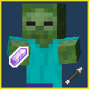

<p align="center"></p>

<h1><p align="center">Intentional Pickup (Bedrock)</p></h1>

<p align="center">A simple addon that makes mobs only pickup items that are intentionally dropped by players.</p>

<div align="center">

[Download from Releases](https://github.com/VoxelBill/intentional-pickup-bedrock/releases)

</div>

## About The Project

**Intentional Pickup (Bedrock)** is a small and lightweight addon that changes mobs to ***only*** pickup items that are dropped by players and optionally only items included in the whitelist or not included in the blacklist. This change should reduce lag by preventing mass build-up of mobs in caves in long term worlds and servers. If running on a server the addon is only required on the server side and is not required to be on the client.

## Configuring The Whitelist/Blacklist

**Intentional Pickup (Bedrock)** has commands for controlling its whitelist and blacklist, by default both lists are empty meaning mobs will pickup any item dropped by a player.

See commands below:

**Note:** The commands require operator permissions to be used.

| Command | Description |
|---------|-------------|
|`/whitelist`|List all items currently in the whitelist|
|`/whitelist add <itemName>`|Adds an item to the whitelist|
|`/whitelist clear`|Clears all items in the whitelist|
|`/whitelist remove <itemName>`|Removes an item from the whitelist|
|`/blacklist`|List all items currently in the blacklist|
|`/blacklist add <itemName>`|Adds an item to the blacklist|
|`/blacklist clear`|Clears all items in the blacklist|
|`/blacklist remove <itemName>`|Removes an item from the blacklist|

If an item appears in both lists, the blacklist takes precedence and overrides the whitelist value.

## Run

1. Download `intentional_pickup-bedrock-x.x.x+mc26.40.mcaddon` from the releases page.
2. Double click the downloaded file to import it into the game.

## Getting Started With Development

To get a local copy up and running, follow these simple steps.

### Prerequisites

Ensure you have the following installed on your machine:

* **Node.js**: Version 22.16.0 or higher.
  * [Download Node.js](https://nodejs.org/)
* **Minecraft: Bedrock Edition**: Version 26.40

### Build

1. **Clone the repository**
```sh
git clone https://github.com/VoxelBill/intentional-pickup-bedrock.git
```

2. Navigate to the project directory
```sh
cd intentional-pickup-bedrock
```

3. Compile project to javascript
```sh
node esbuild.js
```

4. Build the project into packaged addon
```sh
node buildpack.js clean build
```

You can find the built addon at `intentional-pickup-bedrock/build/intentional_pickup-bedrock-x.x.x+mc26.40.zip`.

## Play Java Edition?

**Intentional Pickup** is available as a Minecraft: Java Edition mod. You can visit its repo [here](https://github.com/VoxelBill/intentional-pickup).
